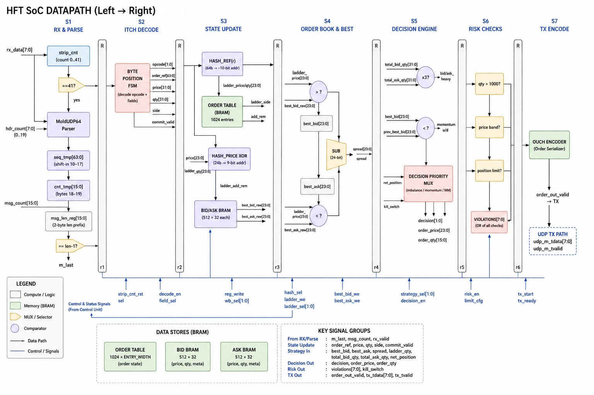

# hft_soc_top

A hardware-only, single-chip front-office trading pipeline: it ingests NASDAQ ITCH market data over UDP, maintains a live limit order book, runs a simple trading strategy, gates every order through pre-trade risk checks, and emits NASDAQ OUCH order messages — entirely in synthesizable Verilog/SystemVerilog with no CPU/software in the data path. Targets the SKY130 open-source PDK via the OpenLane RTL-to-GDSII flow.

## Why hardware

Book-building, signal generation, and risk checks run in combinational/pipelined logic instead of software, so the tick-to-trade loop (market-data byte in → order byte out) completes in a handful of clock cycles instead of microseconds of OS/NIC/software latency.


## Architecture



## Pipeline overview

```
rx_tdata ──> udp_parser ──> moldudp64_parser ──> itch_parser ──> orders_bookkeeper
                                                                        │
                                                                        ▼
                                                                  price_ladder
                                                                   │        │
                                                          ladder_aggregator best_bid_ask
                                                                   │        │
                                                                   └───┬────┘
                                                                       ▼
                                                  position_tracker ─> strategy_engine ─> risk_engine ─> ouch_encoder ──> tx_tdata
```

`latency_monitor` times the loop from `rx_tvalid` (first market-data byte) to `order_sent` (OUCH `m_tlast`). `axi_mgmt_slave` exposes book state, counters, and a kill switch over AXI4-Lite, independent of the main data path.

## Module reference

### `udp_parser.sv`
Strips a fixed 42 bytes (14 Ethernet + 20 IPv4 + 8 UDP) off the incoming AXI-stream byte sequence and forwards everything after byte 41 unmodified. Pure byte-counter FSM (`IDLE → STRIP → FORWARDING`) — does not validate Ethernet type, IP version, or UDP checksum; it assumes the input is exactly that header shape.

**Ports:** `rx_tdata[7:0]/tvalid/tlast/tready` in → `m_tdata[7:0]/tvalid/tlast/tready` out.

### `moldudp64_parser.sv`
Strips the 20-byte MoldUDP64 session header and splits one UDP packet into one-or-more delimited ITCH messages, since MoldUDP64 packs multiple exchange messages per packet.

- Bytes 0–9: session ID, discarded.
- Bytes 10–17: 64-bit sequence number → `sequence_num` output (for gap detection; no recovery logic present).
- Bytes 18–19: 16-bit message count → `msg_count` output.
- Then loops: 2-byte length prefix, then exactly that many payload bytes forwarded as one message with `m_tlast` on the last byte, looping back for the next length prefix if more messages remain in the packet.

**Outputs:** `m_tdata[7:0]`, `m_tlast`, `sequence_num[63:0]`, `msg_count[15:0]`.

### `itch_parser.sv`
Decodes a single ITCH message's bytes into structured fields via a byte-position FSM.

**Key outputs:**
| Signal | Width | Meaning |
|---|---|---|
| `opcode` | 2 | `OP_ADD`(0) / `OP_EXEC`(1) / `OP_DELETE`(2) / `OP_REPLACE`(3) |
| `order_ref` | 64 | order reference number being acted on |
| `new_ref` | 64 | new reference (REPLACE only) |
| `price` | 32 | order price |
| `qty` | 32 | order quantity |
| `side` | 1 | buy/sell |
| `commit_valid` | 1 | pulses 1 cycle when a decoded message is ready |

### `orders_bookkeeper.sv`
Tracks live order references so adds/executes/cancels can be translated into the correct price-level delta. Hashes the 64-bit `order_ref` down to a 10-bit address into a 1024-entry order table (price/qty/side per live order). Outputs `ladder_price/qty[23:0]`, `ladder_side`, `ladder_add_rem` to drive `price_ladder`.

⚠️ **1024-entry table, hashed addressing**: collisions between different live order references are possible and are not detected or resolved — a colliding new order will silently overwrite another order's table entry.

### `price_ladder.sv`
The limit order book itself. Two BRAMs (`bid_bram`, `ask_bram`), 512 × 32 bits each.

- **Addressing**: 24-bit `ladder_price` is XOR-folded to a 9-bit address (`p[8:0] ^ p[17:9] ^ p[23:18]`) rather than directly indexed — this is a hash, not a sorted/CAM structure.
- **Update**: read-modify-write through a saturating add/subtract ALU; `ADD` adds `ladder_qty`, `REM` subtracts but floors at zero instead of underflowing.
- **AXI read port**: a separate read port splits a 16-bit address into a side-select bit and 9-bit slot, muxing between `bid_bram`/`ask_bram` to serve `s_axi_rdata`.

⚠️ **Hash collisions**: two different prices that fold to the same 9-bit address will have their quantities silently merged. With 512 slots over a wide price range this is a real possibility, not just a theoretical one — worth checking against your expected price range/tick size before relying on ladder accuracy.

### `ladder_aggregator.v`
Sums total resting quantity across the whole book for each side, producing `total_bid_qty[31:0]` / `total_ask_qty[31:0]` — the inputs to `strategy_engine`'s imbalance check.

### `best_bid_ask.v`
Tracks top-of-book. Two comparators update `best_bid` (keeps the max bid price seen) and `best_ask` (keeps the min ask price seen); a subtractor computes `spread = best_ask − best_bid`, valid once both sides have a quote (`spread_valid`).

### `position_tracker.v`
Tracks the firm's own net position from its own fills (not the public order book) — a running signed accumulator, `net_position[31:0]` (signed), incremented/decremented as the firm's own orders execute.

### `strategy_engine.v`
Combinational/registered decision logic combining three signals, evaluated in priority order:

1. **Imbalance** — `bid_heavy`/`ask_heavy` flags when one side's total quantity exceeds the other's by 3×.
2. **Momentum** — up/down counters on consecutive `best_bid` increases/decreases; a directional signal fires after a threshold run length.
3. **Market making** — when flat (`net_position == 0`) and spread is wide enough, post a passive limit order one tick inside the spread.

A priority mux picks the final `decision` (BUY/SELL/HOLD), `order_price[23:0]`, `order_qty[15:0]`, and order type. Gated by `kill_switch` from `axi_mgmt_slave`.

### `risk_engine.v`
Mandatory pre-trade checks, combinational, single cycle — every order must clear all three before reaching `ouch_encoder`:

| Check | Rule |
|---|---|
| Fat-finger | reject if quantity exceeds `MAX_ORDER_QTY` |
| Price band | reject if price is outside a band around the current mid-price |
| Position limit | reject if the resulting net position would exceed the configured limit (either direction) |

Violations OR-reduce into `violations[7:0]` / `reject_reason[7:0]`, gating `order_out_valid`. This mirrors the kind of mandatory pre-trade check required by exchange/regulatory rules (e.g. SEC Rule 15c3-5) before any order reaches the market — implemented here as one synchronous gate, not a configurable rule engine.

### `ouch_encoder.v`
Serializes an approved order into a 49-byte (`MSG_LEN`) NASDAQ OUCH-format message, byte-by-byte over an AXI-stream TX interface (`m_tdata/tvalid/tlast`, backpressured by `m_tready`). Counts emitted orders in `order_token_count[31:0]`. Takes `stock_symbol[63:0]` from `axi_mgmt_slave` config.

### `latency_monitor.v`
Free-running cycle counter started on `market_data_valid` (first RX byte of an ITCH message) and stopped on `order_sent` (OUCH `m_tlast`). Tracks `last_latency_cycles`, `min_latency_cycles`, `max_latency_cycles`, and `total_orders` — the tick-to-trade latency metric, the headline number in HFT hardware.

### `axi_mgmt_slave.v`
AXI4-Lite slave exposing SoC status and accepting config writes, independent of the main RX/TX data path.

**Address map:**
| Offset | R/W | Field |
|---|---|---|
| `0x00` | RO | `best_bid[23:0]` |
| `0x04` | RO | `best_ask[23:0]` |
| `0x08` | RO | `spread[23:0]` |
| `0x0C` | RO | `net_position[31:0]` (signed) |
| `0x10` | RO | `total_bid_qty[31:0]` |
| `0x14` | RO | `total_ask_qty[31:0]` |
| `0x18` | RO | `last_latency_cycles` |
| `0x1C` | RO | `min_latency_cycles` |
| `0x20` | RO | `max_latency_cycles` |
| `0x24` | RO | `total_orders` |
| `0x28` | RO | `risk_reject_count` |
| `0x2C` | RO | `reject_reason` (last) |
| `0x30` | RW | `kill_switch` (bit 0) |
| `0x34` | RW | `stock_symbol[63:32]` |
| `0x38` | RW | `stock_symbol[31:0]` |

Default `stock_symbol` resets to `"ZYNE    "`. Unmapped read addresses return `0xDEADBEEF`.

### `hft_soc_top.v`
Top-level integration. External interfaces:

- **RX**: `rx_tdata[7:0]/tvalid/tlast/tready` — AXI-stream market data in, from the MAC.
- **TX**: `tx_tdata[7:0]/tvalid/tlast/tready` — AXI-stream order out, to the MAC.
- **Management**: `mgmt_*` — AXI4-Lite, wired to `axi_mgmt_slave`.
- **Debug/status outputs**: `commit_valid/opcode`, `decision_valid/decision`, `risk_reject/reject_reason`, `best_bid/best_ask/spread(_valid)`, `net_position`, latency stats, `total_orders` — all broken out to top level for observability without going through AXI.

## Repository layout

```
hft_soc/
├── config.json              OpenLane flow configuration
├── udp_parser.sv
├── moldudp64_parser.sv
├── itch_parser.sv
├── orders_bookkeeper.sv
├── price_ladder.sv
├── best_bid_ask.v
├── ladder_aggregator.v
├── position_tracker.v
├── strategy_engine.v
├── risk_engine.v
├── ouch_encoder.v
├── latency_monitor.v
├── axi_mgmt_slave.v
├── hft_soc_top.v
└── runs/                    OpenLane run outputs (per timestamped RUN_*)
```

## Build flow

Built with **OpenLane v1.0.2** targeting **SKY130A** (`sky130_fd_sc_hd` standard cell library), via the dockerized flow:


Key `config.json` settings: `CLOCK_PERIOD` 10 ns, `FP_CORE_UTIL` 40%, `PL_TARGET_DENSITY` 0.45, linting disabled (`RUN_LINTER: false`).

**Last known-good run** (`RUN_2026.06.19_12.59.33`): full flow completed successfully — synthesis through GDSII streamout, zero DRC violations (both Magic and KLayout, with matching XOR diff), LVS and ERC clean. Outstanding warnings at the typical corner, not yet resolved:


## Known limitations / things to verify before relying on this

- **No protocol validation in `udp_parser`**: header lengths are assumed, not checked (no Ethertype, IP version, or UDP checksum verification).
- **No sequence gap recovery**: `moldudp64_parser` exposes `sequence_num` but nothing in this repo acts on a detected gap (no retransmission request, no SoupTCP failover).
- **Hash-collision risk in two places**: `orders_bookkeeper`'s 1024-entry order-ref table and `price_ladder`'s 512-entry price ladder both use XOR/hash addressing with no collision detection — verify your expected order-rate and price-range/tick-size against table depth.
- **Risk engine rules are fixed, not configurable** at runtime beyond what's exposed via `axi_mgmt_slave` (kill switch, symbol) — position limits and price bands are compile-time parameters.
- **Synthesis is not yet timing-clean**: see build flow warnings above.
